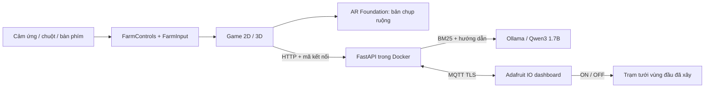

# Android, AR, AI, IO cloud và Docker

© HThinh.yy. Nhánh `codex/rubric-mobile-ar-ai-cloud`, nền `bf7d0b3`.
**Chỉ gộp main sau khi chủ dự án tự chơi thử và xác nhận.**

## Phạm vi

Game Unity 6000.3.22f1 / URP: nông trại, khám phá, nước, chiến đấu, xây dựng,
nhà hàng và minigame được giữ trong scene Farm. Input bàn phím/chuột và
cảm ứng đi qua FarmControls/FarmInput. Không chạy FarmProjectBuilder để dựng lại scene.
Save gameplay vẫn phiên bản 22; cấu hình kết nối và lịch sử chat lưu riêng.



### Kế hoạch và mốc nghiệm thu

| Ngày dự kiến | Công việc | Điều kiện đóng mốc |
|---|---|---|
| 1–2 | Nhánh, sao lưu, bộ build, model, kiểm tra thiết bị | APK chạy; AR tracking thật; đo model |
| 3–6 | Input và toàn bộ giao diện cảm ứng | Các luồng chính chỉ dùng ngón tay |
| 7–8 | Đặt/xoay/phóng nông trại AR và thông tin cây | Vào/thoát giữ phiên chơi, tracking phục hồi |
| 9–10 | Chat tiếng Việt, dữ liệu hướng dẫn, offline | ≥27/30 câu đúng; trả lời ngắn trong 30s khi đã nạp |
| 11–12 | Dashboard tưới hai chiều, Docker | Bản checkout sạch chạy Compose; cloud thật hoạt động |
| 13–14 | Hồi quy, demo, đóng gói, người dùng tự test | Người dùng xác nhận trước merge |

Lịch là ước lượng. Không coi việc viết code/build thành công là đã nghiệm thu thiết bị,
cloud hoặc container. Cần giảng viên xác nhận chấp nhận pretrained model, IoT mô phỏng
và minigame uGUI cho các thành phần rubric tương ứng.

## Chạy backend bằng Docker

1. Cài WSL2 và Docker Desktop, dùng Linux containers; mở Docker Desktop.
   Xem [hướng dẫn Windows chính thức](https://docs.docker.com/desktop/setup/install/windows-install/).
   Cài tự động trong phiên làm việc này bị hệ thống duyệt thao tác chặn (`blocked by policy`);
   chưa có kết quả chạy container trên máy này.
2. Từ gốc checkout, chạy:

```powershell
.\Tools\Start-Services.ps1 -DownloadModel
```

Script tạo `Backend/.env` nếu chưa có, sinh mã kết nối ngẫu nhiên, build API, khởi động
hai dịch vụ và tải model vào Docker volume. Đọc `FARM_PAIRING_KEY` trực tiếp trong `.env`.
Không gửi key lên chat/Git. Nếu đã có `.env`, script giữ cấu hình đó.

3. Gọi `http://127.0.0.1:8000/health`: `model_ready=true` khi tải model xong.
   `mqtt_connected=false` là bình thường nếu chưa có Adafruit IO.
4. Game → **Trợ lý / AR / Cloud → Kết nối / IO cloud**. PC dùng
   `http://127.0.0.1:8000`; điện thoại dùng IP LAN của PC, ví dụ
   `http://192.168.1.10:8000`. Điện thoại/PC cùng Wi-Fi, cho Docker/API qua tường lửa
   mạng Private tại cổng 8000. Nhập mã kết nối và **Lưu & kiểm tra**.
5. Mở Trợ lý AI và hỏi. **Hủy trả lời** hủy yêu cầu từ game; model có thể hoàn tất
   yêu cầu đang chạy phía server rồi nhận yêu cầu tiếp. Nút **Hướng dẫn** luôn đọc được offline.

```powershell
cd Backend
docker compose ps
docker compose logs --tail 60 api
docker compose exec ollama ollama list
docker compose down
```

`down` giữ volume model. Không dùng `down -v` nếu muốn giữ dữ liệu tải.
PC 8 GB RAM nên đóng Unity Editor trong lúc demo model. `api` giới hạn 384 MB,
`ollama` 3 GB; thời gian suy luận còn phụ thuộc CPU và bộ nhớ WSL.
Không mở Ollama ra LAN; chỉ API cổng 8000 phục vụ game với mã kết nối.

### Model và kiến thức

Model có sẵn **Qwen3 1.7B Q4_K_M**, Apache-2.0, tải khoảng 1,36 GB.
Nguồn [Qwen](https://huggingface.co/Qwen/Qwen3-1.7B),
[Ollama](https://ollama.com/library/qwen3:1.7b), giấy phép ở
`Backend/licenses/Qwen3-Apache-2.0.txt`, digest trong `Backend/MODEL-MANIFEST.json`.
Dự án không huấn luyện/fine-tune model và không đưa weights vào Git/APK.
Backend BM25 lấy ba mục gần câu hỏi rồi gửi cho model, `think=false`. Qwen chọn
một mục qua JSON schema; server trả nguyên đoạn hướng dẫn ngắn của mục đó.
Với câu tiếp nối ngắn không có chủ đề mới, giữ mục đã tham chiếu ở câu trước
(chỉ khớp văn bản hướng dẫn có sẵn); nếu chưa có mục, dùng mục gần câu trước nhất.
Model vẫn xử lý yêu cầu. Các câu hỏi có chủ đề mới tìm lại mục riêng; câu ngoài
phạm vi không bị kéo về chủ đề của lịch sử chat.
Đoạn đầy đủ giữ điều kiện và ngoại lệ, tránh lỗi model chọn nhầm mã câu hoặc bỏ ý.
Đây là QA trích xuất, không sinh câu trả lời tự do: API ghi `generation_mode=extractive`.
Trợ lý chỉ tư vấn, không cấp vật phẩm/đổi save. Kết quả kèm tên mục nguồn.
Kiến thức nằm `Backend/app/knowledge.json`; bản offline Unity phải giống hệt file này.

## Adafruit IO — có thể tạo tài khoản sau

Chưa có tài khoản nên cloud mặc định tắt. Gameplay thường, trạm tưới cục bộ,
AR và hướng dẫn tĩnh tiếp tục dùng được; chatbot chỉ cần backend/model.

1. Tạo tài khoản tại [Adafruit IO](https://io.adafruit.com/).
2. Tạo bốn feed, giữ đúng key:

| Feed key | Block dashboard | Giá trị |
|---|---|---|
| `farm-moisture` | Gauge + Line chart | 0–100, độ ẩm cây vùng đầu |
| `farm-growth` | Gauge + Line chart | 0–100, tiến độ trung bình |
| `farm-pump-state` | Indicator | ON / OFF: trạng thái thực tế |
| `farm-pump-command` | Toggle | ON / OFF: lệnh người dùng |

3. Dashboard đặt tên **Nông Trại — dữ liệu mô phỏng**. Toggle bật gửi `ON`, tắt `OFF`.
   Đọc username và AIO Key tại tài khoản; nhập **chỉ trên PC** trong `Backend/.env`:

```dotenv
ADAFRUIT_IO_USERNAME=ten_tai_khoan
ADAFRUIT_IO_KEY=nhap_key_tren_may
ADAFRUIT_IO_PREFIX=farm
```

4. `docker compose up -d --force-recreate api`. Kiểm tra `/health` có MQTT kết nối.
5. Trong game xây **trạm tưới vùng đầu**, trồng cây, mở kết nối rồi **Bật cloud**.
   Chờ 20 giây, đối chiếu số liệu. Gạt công tắc, chờ tối đa một lượt poll (~5–13s
   tùy mạng), quan sát trạm và indicator thực tế ở lượt telemetry sau.
6. Thử mất Internet/PC, lệnh trùng, đóng game/kết nối lại, phiên game khác.

MQTT TLS8883, mỗi 20s gửi 3 feed (~9 bản ghi/phút). Backend còn chặn >20 bản ghi/phút.
Lệnh retained/cũ sau kết nối lại bị bỏ; session GUID, revision và server boot ID
ngăn áp dụng nhầm phiên/ack. Chỉ một phiên giữ lease 65s. Trạm phải đã xây;
cloud không mở khóa, tạo vòi hoặc đổi phạm vi/thời gian tưới. Ngắt mạng quay về tưới cục bộ.
Tham khảo [API MQTT Adafruit](https://learn.adafruit.com/welcome-to-adafruit-io/adafruit-io-mqtt-api).

## Android và AR

Unity Hub: cài Android Build Support + SDK/NDK/OpenJDK cho **6000.3.22f1**.
`Tools/Install-AndroidSupport.ps1` dùng metadata module chính thức của Editor để cài vào
thư mục Unity và kiểm checksum; đóng Unity trước khi dùng.
Build từ scene đang lưu:

```powershell
.\Tools\Build-Android.ps1
```

Kết quả `Builds/Android/NongTrai.apk`: ARM64 IL2CPP, Android8/API26 trở lên,
target36, OpenGLES3, màn hình ngang, ARCore Optional. APK dùng khóa debug Unity
để cài trực tiếp; chưa là bản ký phát hành Google Play.
Không cần cảm biến/AR để chơi game thường. Android đọc JSON đã đóng trong Resources,
không dùng đường dẫn file trong APK.

### Điều khiển chạm

Joystick di chuyển; vuốt vùng bên phải xoay camera. Giữ **Chạy**, chạm **Nhảy**.
**Dùng/Đánh** thay chuột trái; **Tương tác** thay chuột phải. Cung giữ/thả,
đào giữ, xô múc/đặt, khối chọn hotbar rồi đặt và **Xoay**. Menu có đổi góc nhìn,
cho thú ăn, bay sáng tạo/hạ, lưu, shop, máy, chuồng, mở đất, bản đồ/minigame.
Túi kéo/thả, **Tách nửa**, **Chuyển nhanh**; rương lấy từng món hoặc tất cả.
Runner có nút trái/phải/nhảy/trượt. Câu cá và nhà hàng dùng nút nhịp trên bảng.
UI lớn tự co theo màn hình; điều khiển world dùng safe area.
Windows có thể xem bố cục chạm bằng `NongTrai.exe -farmTouch`.

### AR trên PC

Menu → **Nông trại AR** mở mô hình của ruộng hiện tại. Giữ chuột phải xoay,
lăn chuột phóng, click nền trống để đặt mô hình trên mặt phẳng ảo; click cây/công trình
để xem thông tin. Có nút xoay/phóng thay chuột, **Đặt lại**, **Hỏi trợ lý [C]** và **Đóng AR**.
**Bật webcam** ghép nông trại lên hình camera, **Tắt webcam** giải phóng thiết bị.
Không tự mở webcam khi vào màn hình; mất quyền, thiếu camera hoặc camera bận có thông báo.
Mô hình PC đặt thủ công, không dò mặt phẳng/tracking chuyển động camera.
Xử lý luồng camera dùng [Unity WebCamTexture](https://docs.unity3d.com/6000.3/Documentation/ScriptReference/WebCamTexture.html).
Phiên chơi tạm dừng; đóng AR phục hồi camera/vị trí. **C** mở chatbot trong game hoặc AR,
chat cần backend như phần thiết lập trên; **H** ẩn/hiện bảng hướng dẫn khi chơi.

### AR tracking trên Android

Dùng thiết bị trong [danh sách ARCore](https://developers.google.com/ar/devices).
Menu → **Nông trại AR** → cho phép camera → quét bàn/sàn → chạm đặt.
Hai ngón xoay/phóng; chạm cây/công trình xem trạng thái, **Hỏi trợ lý** để mở chat.
**Đặt lại** tạo vị trí mới; **Đóng AR** phục hồi camera/vị trí phiên chơi.
Không hỗ trợ/từ chối camera/tracking yếu có thông báo và nút về game.
Ảnh miniature desktop chỉ chứng minh model hiển thị; không phải bằng chứng AR tracking.

## API

| Endpoint | Công dụng |
|---|---|
| GET `/health` | Model có tải, MQTT có nối; không chứa key |
| GET `/v1/pair` | Kiểm tra mã kết nối |
| POST `/v1/chat` | question, context, history → answer, sources, model, generated |
| POST `/v1/telemetry` | session_id, moisture/growth_percent, station_built, pump_active, simulation=true |
| GET `/v1/control?session_id=…` | server_id, revision, has_command, pump_enabled |
| POST `/v1/control/ack` | session/server/revision, applied, pump_active, reason |
| DELETE `/v1/control?session_id=…` | Ngắt lease của phiên |

Mọi `/v1/*` cần header `X-Farm-Key`. Cấu hình và lịch sử chat lưu dưới persistentDataPath
trong `farm-connection.json`, `farm-chat-history.json`; không nằm trong save gameplay.

## Kiểm thử, minh chứng và bàn giao

Xem [TEST_RESULTS.md](TEST_RESULTS.md), [ACCEPTANCE.md](ACCEPTANCE.md),
[DEMO.md](DEMO.md) và thư mục `Evidence/Rubric`.
Nhánh chưa được coi là nghiệm thu toàn bộ rubric khi còn thiết bị/cloud/Docker chờ kiểm tra.
Source, EXE/ZIP và APK bàn giao có commit/SHA256 trong DongGoi. Không đưa Library,
Logs, cache, khóa cloud hoặc model weights vào source.
